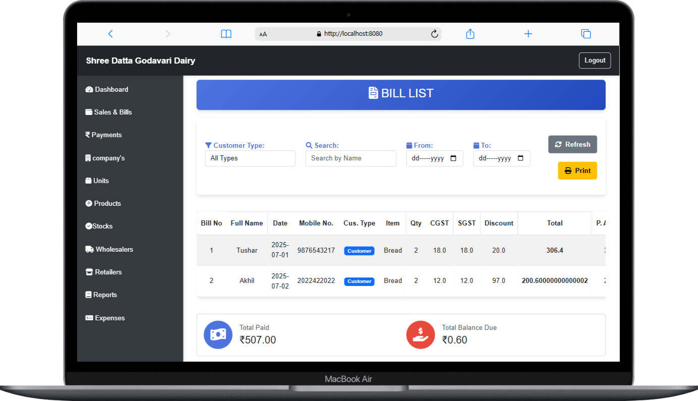

<div align="center">
  
  <h1>👋 Welcome to <span style="color:#28a745">Shree Datta Godavari Dairy</span>!</h1>
  <p><b>Comprehensive Dairy Business Management System</b></p>
</div>

---

<div align="center">
  
  
  
  
</div>

---

<h3>🔐 Demo Credentials</h3>
<ul>
  <li><b>Email ID:</b> <code>admin@gmail.com</code> <i>(case-sensitive)</i></li>
  <li><b>Password:</b> <code>pass</code> <i>(case-sensitive)</i></li>
</ul>

---

<h2>✨ Features</h2>
<ul>
  <li>📊 <b>Comprehensive Dashboard</b> - Get a quick overview of your dairy business</li>
  <li>🧾 <b>Bill Management</b> - Create, view, and print bills for customers, retailers, and wholesalers</li>
  <li>💰 <b>Payment Tracking</b> - Monitor all transactions and payment statuses</li>
  <li>📦 <b>Inventory Management</b> - Track stock levels and product availability</li>
  <li>👥 <b>Customer Management</b> - Maintain records of retailers and wholesalers</li>
  <li>🏢 <b>Company Management</b> - Organize supplier and partner companies</li>
  <li>📱 <b>Responsive Design</b> - Access the system from any device</li>
  <li>🔐 <b>Secure Authentication</b> - Protect your business data</li>
  <li>📧 <b>Email Notifications</b> - Automated email system for important updates</li>
  <li>📈 <b>Expense Tracking</b> - Monitor and analyze business expenses</li>
</ul>

---

<h2>🖥️ System Screenshots</h2>

<div align="center">
  <p><i>Dashboard view showing business metrics and recent transactions</i></p>
  
  
  <p><i>Bills management interface</i></p>
  
  
  <p><i>Bill printing view</i></p>
  
  
  <p><i>Transactions tracking</i></p>
  
</div>

---

<h2>🚀 Getting Started</h2>

<h3>Prerequisites</h3>
<ul>
  <li>Java 17 or higher</li>
  <li>MySQL Database</li>
  <li>Maven</li>
</ul>

<h3>Installation</h3>

<ol>
  <li><b>Clone the repository</b></li>
  
  <li><b>Configure environment variables:</b>
    <pre><code>cp .env.example .env
# Edit the .env file with your database and email credentials</code></pre>
  </li>
  
  <li><b>Build the application:</b>
    <pre><code>mvn clean install</code></pre>
  </li>
  
  <li><b>Run the application:</b>
    <pre><code>mvn spring-boot:run</code></pre>
    or
    <pre><code>java -jar target/dairyManagement-0.0.1-SNAPSHOT.jar</code></pre>
  </li>
  
  <li><b>Access the application</b> at <code>http://localhost:8080</code></li>
</ol>

---

<h2>📁 Project Structure</h2>

```text
src/
├── main/
│   ├── java/
│   │   └── com/
│   │       └── DM/
│   │           └── dairyManagement/
│   │               ├── controller/    # Web controllers
│   │               ├── model/         # Data models
│   │               ├── repository/    # Database repositories
│   │               ├── service/       # Business logic
│   │               └── DairyManagementApplication.java
│   └── resources/
│       ├── static/                    # Static resources (CSS, JS)
│       ├── templates/                 # Thymeleaf templates
│       └── application.properties     # Application configuration
└── test/                              # Test classes
```

---

<h2>⚙️ Environment Setup</h2>

<h3>Database Configuration</h3>
<p>The application uses MySQL. Configure your database connection in the <code>.env</code> file:</p>

```properties
DB_URL=jdbc:mysql://localhost:3306/your_db_name?createDatabaseIfNotExist=true
DB_USERNAME=your_username
DB_PASSWORD=your_password
```

<h3>Email Configuration</h3>
<p>For email functionality, set up a Gmail account with an App Password:</p>

1. Enable 2-Step Verification in your Google Account
2. Generate an App Password for the application
3. Configure in the <code>.env</code> file:

```properties
MAIL_USERNAME=your_email@gmail.com
MAIL_PASSWORD=your_app_password
MAIL_HOST=smtp.gmail.com
MAIL_PORT=587
```

<h3>Admin Credentials</h3>
<p>Set your admin login credentials in the <code>.env</code> file:</p>

```properties
ADMIN_EMAIL=your_admin_email@example.com
ADMIN_PASSWORD=your_secure_admin_password
```

---

<h2>🔧 Key Technologies</h2>
<ul>
  <li><b>Backend:</b> Spring Boot 3.4.2, Java 17</li>
  <li><b>Database:</b> MySQL</li>
  <li><b>Frontend:</b> Thymeleaf, Bootstrap 5, Chart.js</li>
  <li><b>Security:</b> Spring Security Crypto</li>
  <li><b>Email:</b> Spring Mail</li>
  <li><b>Build Tool:</b> Maven</li>
</ul>

---

<h2>🌟 Features in Detail</h2>

<h3>Dashboard</h3>
<p>The dashboard provides a comprehensive overview of your dairy business, including:</p>
<ul>
  <li>Total number of companies, products, bills, and payments</li>
  <li>Recent transactions and their status</li>
  <li>Latest added products and companies</li>
  <li>Visual charts for business analytics</li>
</ul>

<h3>Bill Management</h3>
<p>Create and manage bills for different types of customers:</p>
<ul>
  <li>Generate bills with automatic calculations for taxes and discounts</li>
  <li>Print bills for customers</li>
  <li>Track payment status and balance due</li>
  <li>Separate views for retailer, wholesaler, and customer bills</li>
</ul>

<h3>Inventory Management</h3>
<p>Keep track of your dairy products inventory:</p>
<ul>
  <li>Add and update product stock</li>
  <li>Monitor stock levels</li>
  <li>Automatic stock adjustment when bills are created</li>
</ul>

<h3>User Management</h3>
<p>Secure user authentication and profile management:</p>
<ul>
  <li>User registration with profile photo</li>
  <li>Secure password storage with BCrypt encryption</li>
  <li>Profile editing capabilities</li>
</ul>

---

<h2>💡 Contributing</h2>
<p>Contributions are welcome! Please feel free to submit a Pull Request.</p>

---

<h2>📄 License</h2>
<p>This project is licensed under the MIT License.</p>

---

<h2>📞 Support</h2>
<p>For support, please contact the development team or open an issue in the repository.</p>

<div align="center">
  <p>Made with ❤️ for dairy businesses</p>
</div>